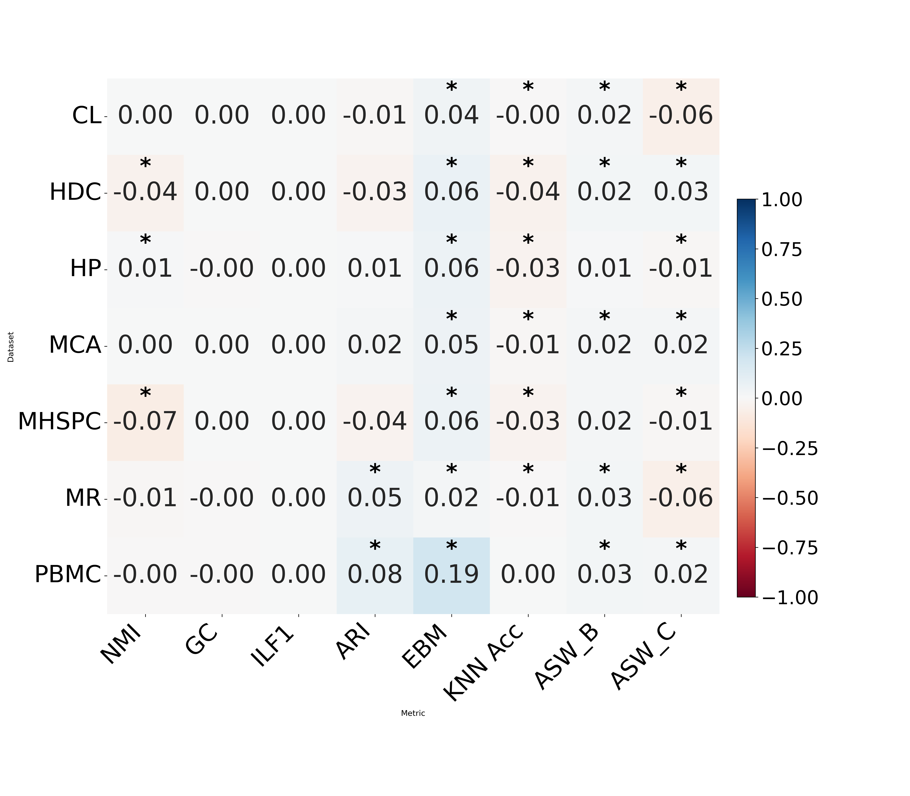

# Mann-Whitney U Test Analysis for Model Comparison

This repository contains a Python script (`main.py`) to perform statistical comparison between two models (`FedscGen-SMPC` vs `scGen`) using the **Wilcoxon-Mann-Whitney (WMW)** test.We performed a statistical comparison between the performance of FedScGen and scGen across multiple datasets and evaluation metrics using the Wilcoxon-Mann-Whitney (WMW) test. This non-parametric test is appropriate for assessing whether two independent samples are drawn from the same distribution.
For each metric-dataset pair, we compared performance scores from 10 independent runs (seeds) for both models, treating them as independent samples.
We formulated the null hypothesis (H₀) as the two samples being drawn from identical distributions, and the alternative hypothesis (H₁) as the samples coming from different distributions, indicating a performance difference. After computing the p-values for each comparison:
We applied the Benjamini-Hochberg (BH) correction to control the false discovery rate (FDR) across multiple tests.
Metric-dataset pairs with an adjusted p-value < 0.01 were considered statistically significant.
We visualized the results in a heatmap, showing:
The average performance difference between models.
Statistically significant cells highlighted with stars (*) or color.

---

## 📦 Environment Setup

To ensure reproducibility, use the provided `environment.yml` file to create a Conda environment with all dependencies:

```bash
conda env create -f environment.yml
conda activate plot
```
🚀 How to Run

The `smpc_wilcoxon.csv` file contains columns for:
* Dataset: scGen and FedscGen-SMPC
* Approach (with values scGen and FedscGen-SMPC)
* Metrics: NMI, GC, ILF1, ARI, EBM, KNN Acc, ASW_B, ASW_C

Run the analysis with:
```python
python main.py
```
📊 Output

* Heatmap: wilcoxon_pvalue_heatmap.png showing average performance differences between the models.

* Console Output: Number of significant metric-dataset pairs and their adjusted p-values (if < 0.05).

🧪 Statistical Test Description

The script performs the Wilcoxon-Mann-Whitney (Mann-Whitney U) test to compare the distributions of performance scores from 10 independent runs (seeds) for each model. This non-parametric test does not assume paired observations or normal distribution and is appropriate for evaluating whether the performance of one model is stochastically greater than the other.


